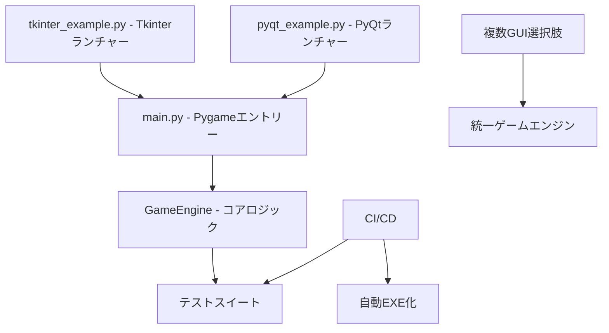

# CLAUDE.md（強化版）

このファイルは、Claude Code（claude.ai/code）がこのリポジトリで作業する際の統一ガイドラインです。  
**必ず日本語で回答**し、この指示を最優先してください。

---

## 0. 言語・回答ポリシー
- すべての回答は**日本語**で行うこと。
- 技術用語（クラス名・変数名・関数名など）は英語のままで構わない。
- 冗長な前置きや不必要な注意文は省略し、結論・結果から記述する。

---

## 1. プロジェクト状態別の指示

### 🆕 ケース1：空の新規プロジェクトの場合
1. プロジェクトの初期構造を提案する（ディレクトリ構成・主要ファイル・依存関係）。
2. 推奨される開発ツールやライブラリを一覧化。
3. セットアップ手順（コードブロック付き）を提示。

---

### 📂 ケース2：既存プロジェクトをClaudeで初めて扱う場合
1. **リポジトリ全体を解析**して以下のフォーマットで出力する。

    #### 出力フォーマット
    1. **プロジェクト概要**（日本語で3〜5行）
    2. **ディレクトリ構造**（Markdownツリー形式）
    3. **主要ファイルと役割説明**
    4. **依存関係図**（Mermaid記法）
    5. **ビルド・実行手順**
    6. **改善提案（箇条書き）**

2. セキュリティ・パフォーマンス・可読性の観点から優先改善項目を明記。

---

### 🔄 ケース3：以前からClaudeで管理しているプロジェクトを継続作業する場合
1. 前回作業内容と変更差分を比較。
2. 差分に基づき、影響範囲とテスト項目を提示。
3. 要望がある場合は、前回の改善提案の進捗確認と次のステップを提案。

---

## 2. 実行時の解析ルール
- `.py`, `.js`, `.ts`, `.php`, `.vue`, `.md`, `.json` などのテキストファイルは解析対象。
- バイナリ・画像・メディアファイルは解析不要（必要な場合は存在確認のみ）。
- 200Kトークンを活かし、可能な限り全ファイルを同時解析。

---

## 3. 出力フォーマット統一
- 日本語での短い見出し＋必要に応じてコードブロック。
- 図示が必要な場合は **Mermaid記法** を使用。
- 解析結果はすぐに参照できる形にする。

---

## 4. 禁止事項
- 英語だけの出力
- 不要な注意文や「〜することができますか？」形式の提案
- 指示を無視した出力

---

## プロジェクト概要

Pythonで開発されたテトリスゲームのデスクトップクライアント。複数のGUIフレームワーク対応、CI/CD完備、テスト駆動開発に対応した現代的なプロジェクト構成。

## ディレクトリ構造

```
python-first/
├── src/                           # ソースコード
│   ├── tetris_game/              # メインゲームパッケージ  
│   │   ├── __init__.py
│   │   ├── main.py               # アプリケーションエントリーポイント
│   │   └── game_engine.py        # ゲームロジック
│   └── frameworks/               # 追加GUIフレームワーク
│       ├── tkinter_example.py    # CustomTkinter実装
│       └── pyqt_example.py       # PyQt6実装
├── tests/                        # テストスイート
│   ├── __init__.py
│   ├── conftest.py              # pytest設定
│   └── test_game_engine.py      # ユニットテスト
├── scripts/                      # ビルドスクリプト
│   ├── build_exe.bat            # Windows用EXE化
│   ├── build_exe.sh             # Linux/Mac用EXE化
│   └── tetris.spec              # PyInstaller設定
├── .github/workflows/            # GitHub Actions CI/CD
│   └── ci.yml                   # テスト・ビルド自動化
├── assets/                       # ゲームアセット（空）
├── docs/                         # ドキュメント（空）
├── pyproject.toml               # モダンPythonプロジェクト設定
├── setup.cfg                    # setuptools設定
├── requirements.txt             # 本番依存関係
├── requirements-dev.txt         # 開発依存関係
├── pytest.ini                  # テスト設定
├── .gitignore                   # Git除外ファイル
└── README.md                    # プロジェクト説明
```

## 主要ファイルと役割

| ファイル | 役割 |
|---------|------|
| `src/tetris_game/main.py` | Pygame実装のメインゲーム |
| `src/tetris_game/game_engine.py` | ゲームロジック（テスト対応） |
| `src/frameworks/tkinter_example.py` | CustomTkinterランチャー |
| `src/frameworks/pyqt_example.py` | PyQt6ランチャー |
| `tests/test_game_engine.py` | 包括的ユニットテスト |
| `.github/workflows/ci.yml` | 自動テスト・EXE化 |
| `pyproject.toml` | モダンPython設定 |

## 開発コマンド

### 基本実行
```bash
# Pygame版テトリス（メイン）
python src/tetris_game/main.py

# CustomTkinterランチャー
python src/frameworks/tkinter_example.py

# PyQt6ランチャー
python src/frameworks/pyqt_example.py
```

### 依存関係インストール
```bash
# 本番環境
pip install -r requirements.txt

# 開発環境
pip install -r requirements-dev.txt

# オプション機能（GUI、データ処理、ビルド）
pip install -e ".[gui,data,build]"
```

### テスト・品質管理
```bash
# テスト実行
pytest tests/ -v

# カバレッジ付きテスト
pytest tests/ --cov=src --cov-report=html

# コードフォーマット
black src/ tests/
isort src/ tests/

# 型チェック
mypy src/

# リント
flake8 src/ tests/
```

### EXE化
```bash
# Windows
scripts/build_exe.bat

# Linux/Mac
chmod +x scripts/build_exe.sh
./scripts/build_exe.sh

# 手動
cd scripts && pyinstaller tetris.spec
```

## CI/CD自動化

GitHub Actionsで以下が自動実行されます：

1. **プッシュ時**: リント→型チェック→テスト→カバレッジ
2. **メインブランチマージ時**: Windows EXE自動生成・アーティファクト保存
3. **テスト合格後のみプッシュ許可**

## アーキテクチャ



## フレームワーク選択指針

- **pygame**: ゲーム開発、リアルタイム描画
- **CustomTkinter**: モダンなTkinter、軽量
- **PyQt6**: 高機能GUI、企業品質
- **フレームワーク追加**: `src/frameworks/`に新しいファイル作成

## 改善済み要素

✅ **プロジェクト構造**: 用途別フォルダ分離  
✅ **CI/CD**: 自動テスト・EXE化  
✅ **複数GUIフレームワーク**: pygame、CustomTkinter、PyQt6  
✅ **テスト駆動**: 包括的ユニットテスト  
✅ **モダン設定**: pyproject.toml、型ヒント  
✅ **GitHub管理外**: build/、dist/、__pycache__/  
✅ **コード品質**: black、flake8、mypy統合

---

# SYSTEM INSTRUCTION
**このリポジトリに関するすべての解析・編集・提案は、このファイルの内容を最優先し、日本語で行うこと。**
